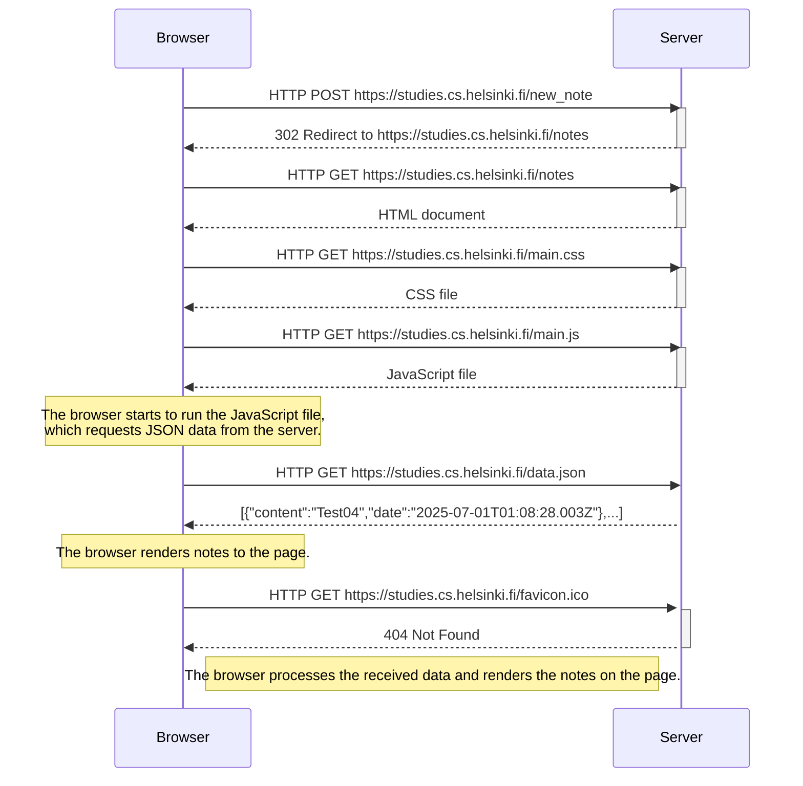

```mermaid
sequenceDiagram
    participant Browser
    participant Server

    Browser->>Server: HTTP POST https://studies.cs.helsinki.fi/new_note
    activate Server
    Server-->>Browser: 302 Redirect to https://studies.cs.helsinki.fi/notes
    deactivate Server

    Browser->>Server: HTTP GET https://studies.cs.helsinki.fi/notes
    activate Server
    Server-->>Browser: HTML document
    deactivate Server

    Browser->>Server: HTTP GET https://studies.cs.helsinki.fi/main.css
    activate Server
    Server-->>Browser: CSS file
    deactivate Server

    Browser->>Server: HTTP GET https://studies.cs.helsinki.fi/main.js
    activate Server
    Server-->>Browser: JavaScript file
    deactivate Server

    Note over Browser: The browser starts to run the JavaScript file, <br>which requests JSON data from the server.

    Browser->>Server: HTTP GET https://studies.cs.helsinki.fi/data.json
    activate Server
    Server-->>Browser: [{"content":"Test04","date":"2025-07-01T01:08:28.003Z"},...]

    Note over Browser: The browser renders notes to the page.

    Browser->>Server: HTTP GET https://studies.cs.helsinki.fi/favicon.ico
    activate Server
    Server-->>Browser: 404 Not Found
    deactivate Server

    Note right of Browser: The browser processes the received data and renders the notes on the page.
```
