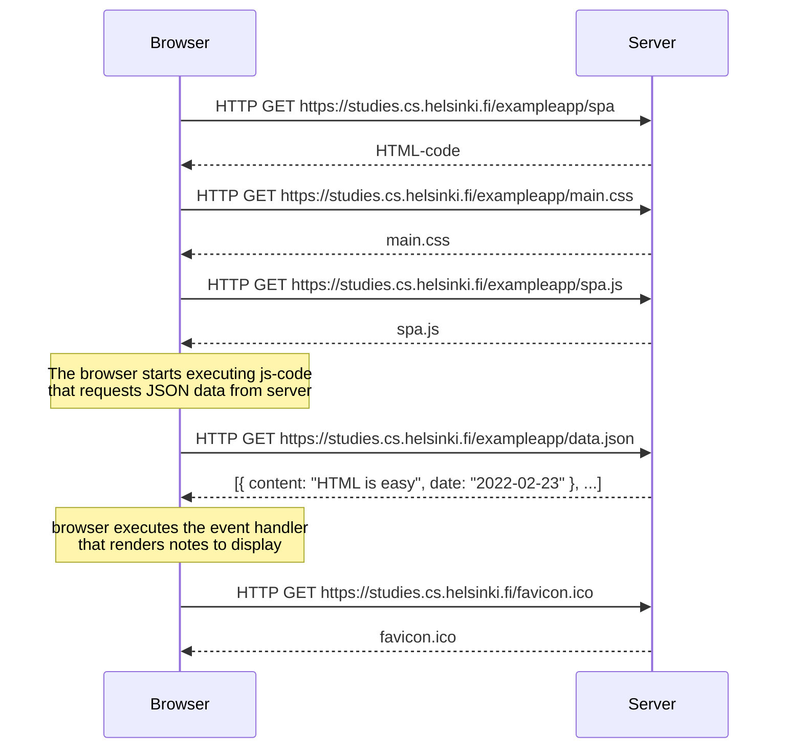

```mermaid
sequenceDiagram
    participant Browser
    participant Server

    Browser->>Server: HTTP GET https://studies.cs.helsinki.fi/exampleapp/spa
    Server-->>Browser: HTML-code

    Browser->>Server: HTTP GET https://studies.cs.helsinki.fi/exampleapp/main.css
    Server-->>Browser: main.css

    Browser->>Server: HTTP GET https://studies.cs.helsinki.fi/exampleapp/spa.js
    Server-->>Browser: spa.js

    Note over Browser: The browser starts executing js-code<br/>that requests JSON data from server

    Browser->>Server: HTTP GET https://studies.cs.helsinki.fi/exampleapp/data.json
    Server-->>Browser: [{ content: "HTML is easy", date: "2022-02-23" }, ...]

    Note over Browser: browser executes the event handler<br/>that renders notes to display

    Browser->>Server: HTTP GET https://studies.cs.helsinki.fi/favicon.ico
    Server-->>Browser: favicon.ico

```
